# Day_translation2 核心函数调用关系图谱

## 🎯 核心函数调用链路图

### 1. 主调用链 (Main Call Chain)

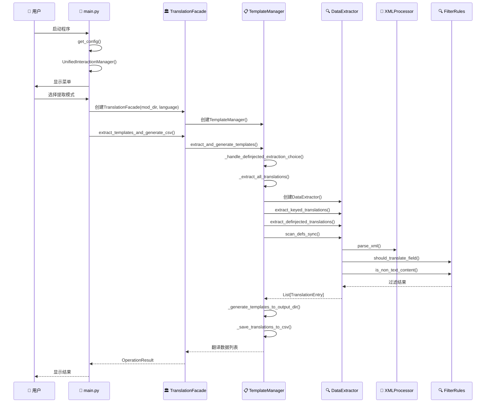

### 2. 提取模式函数调用树

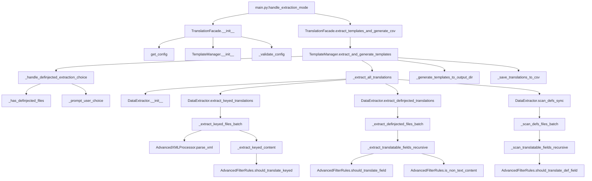

### 3. 递归提取函数调用深度图

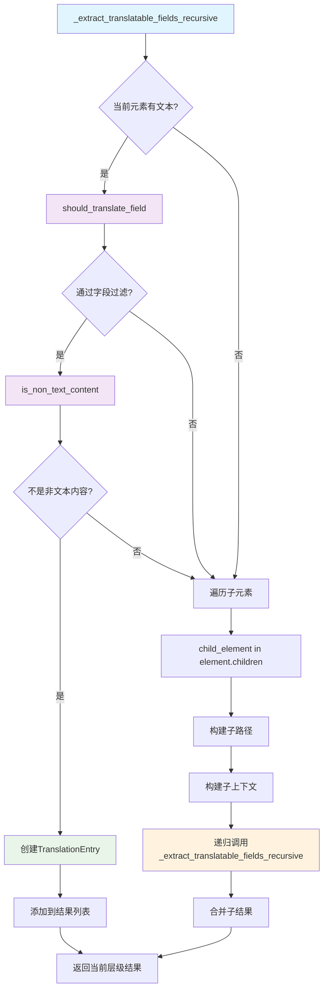

## 🔧 核心函数详细调用图

### DataExtractor 核心方法调用关系

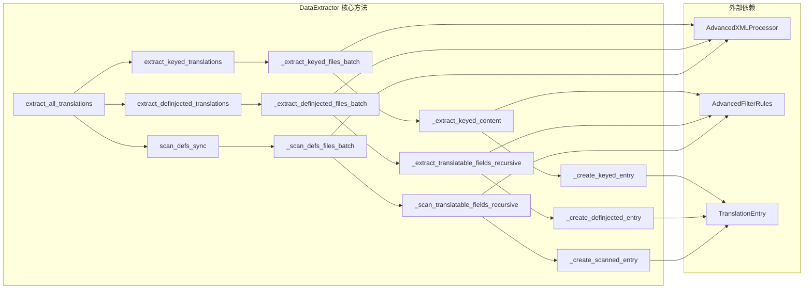

### AdvancedFilterRules 决策调用图

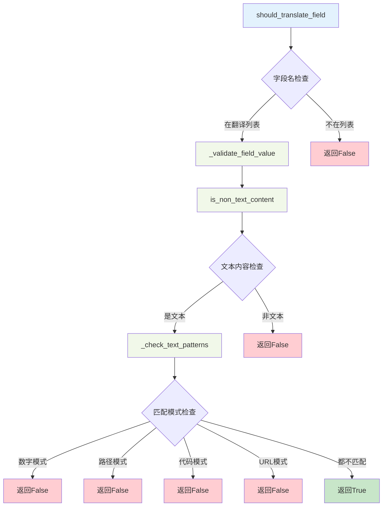

### 模板生成调用链

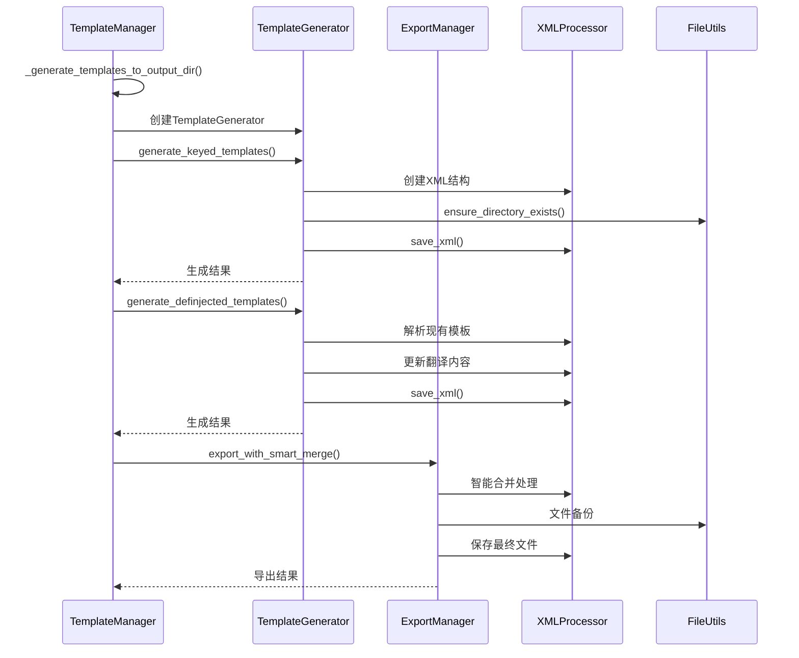

## 📊 函数复杂度和调用频率分析

### 高频调用函数 (Hot Path Functions)

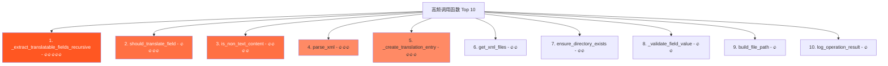

### 函数复杂度分析

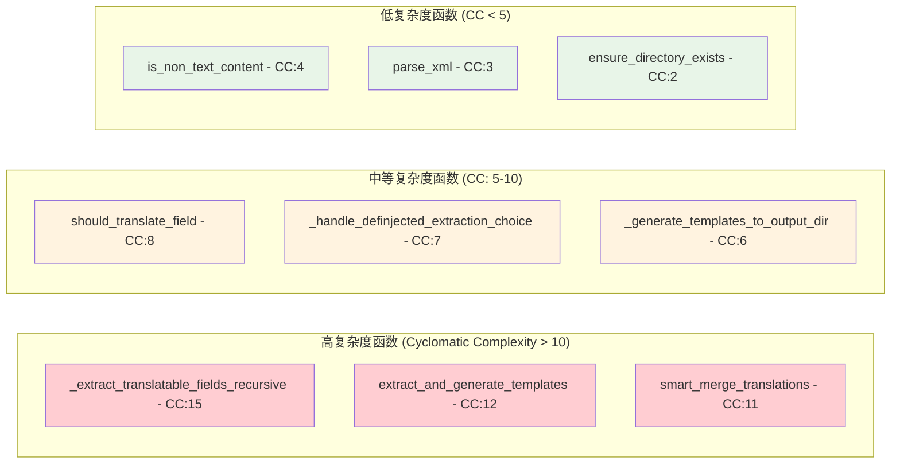

## 🔗 模块间依赖关系图

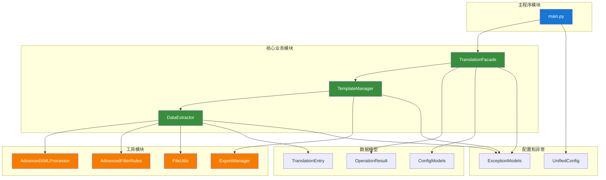

## 📈 性能瓶颈识别

### 性能热点分析

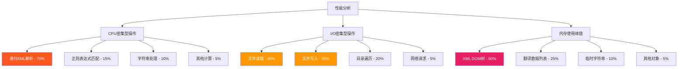

## 🎯 优化建议和改进点

### 函数优化建议

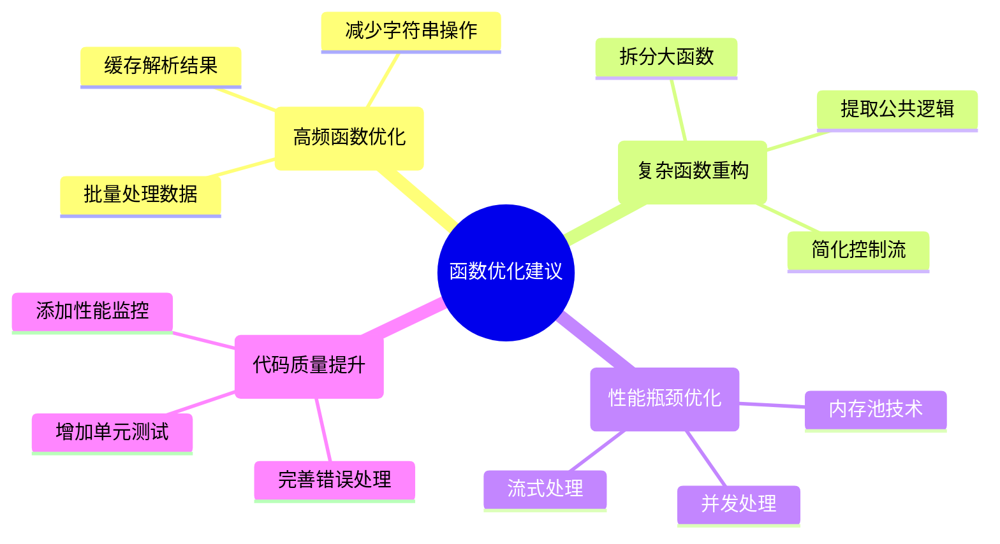

---

这个详细的函数调用关系图谱展示了Day_translation2系统中所有核心函数之间的调用关系，有助于理解系统的内部工作机制和识别性能优化点。
