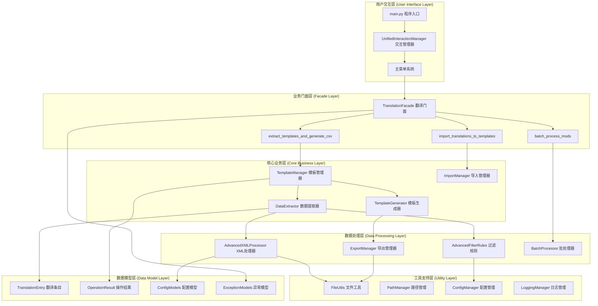
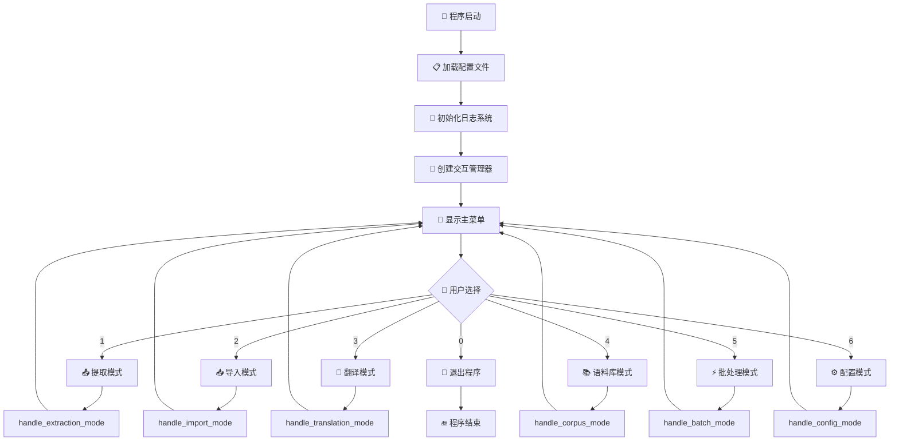
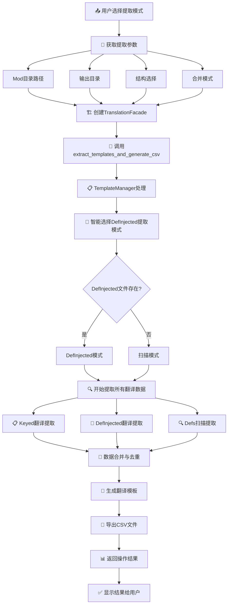
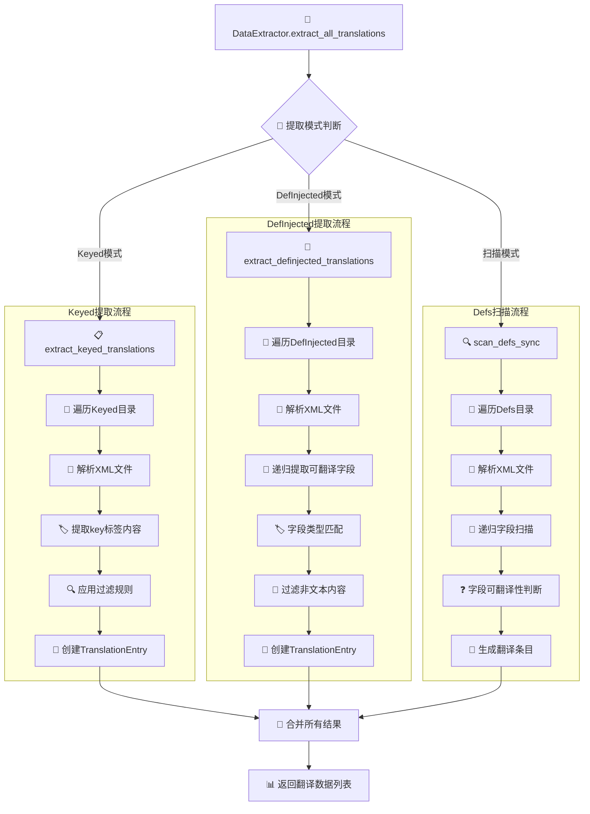
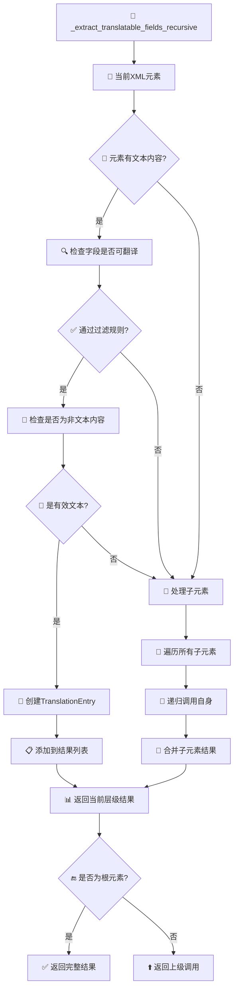
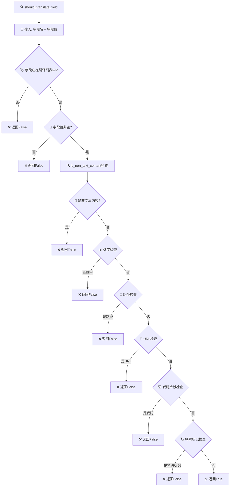
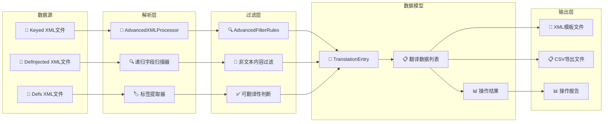
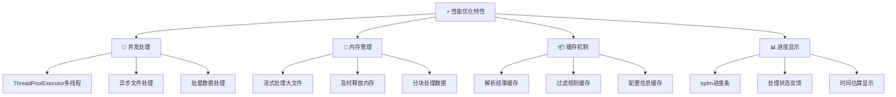

# Day_translation2 系统架构可视化图表

## 🏗️ 系统整体架构图



## 🔄 主要操作流程图

### 1. 系统启动和主菜单流程



### 2. 提取模式详细流程



### 3. 数据提取核心算法流程



### 4. 递归字段提取算法



### 5. 过滤规则决策树



## 📊 数据流向图



## 🔧 核心算法伪代码

### 递归字段提取算法

```python
function extract_translatable_fields_recursive(element, path="", context=""):
    results = []
    
    // 处理当前元素文本
    if element.text and element.text.strip():
        if filter_rules.should_translate_field(element.tag, element.text):
            if not filter_rules.is_non_text_content(element.text):
                entry = create_translation_entry(element, path, context)
                results.append(entry)
    
    // 递归处理子元素
    for child in element.children:
        child_path = build_path(path, child.tag)
        child_context = build_context(context, element)
        child_results = extract_translatable_fields_recursive(
            child, child_path, child_context
        )
        results.extend(child_results)
    
    return results
```

### 智能合并算法

```python
function smart_merge_translations(existing_translations, new_translations):
    merged_results = []
    
    for new_entry in new_translations:
        existing_entry = find_existing_entry(existing_translations, new_entry.key)
        
        if existing_entry is None:
            // 新条目，直接添加
            merged_results.append(new_entry)
        else if existing_entry.is_empty() or existing_entry.is_machine_translated():
            // 现有条目为空或机器翻译，使用新条目
            merged_results.append(new_entry)
        else:
            // 保留现有的人工翻译
            merged_results.append(existing_entry)
    
    return merged_results
```

## 📈 性能特性图



---

这个可视化系统架构图表完整展示了Day_translation2系统从用户交互到数据处理的完整流程，每个层次的职责都很清晰，便于理解和维护。
