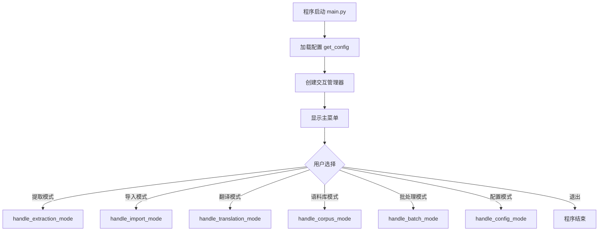
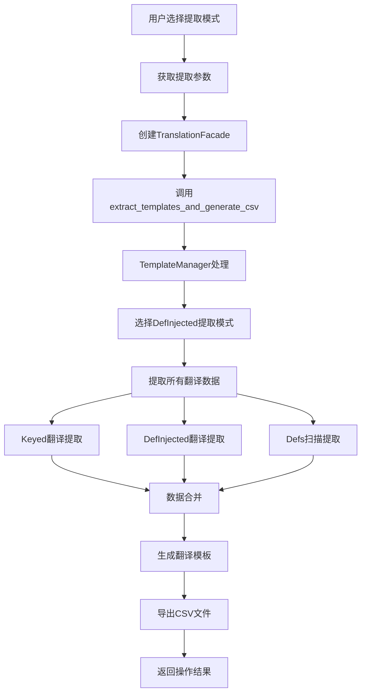
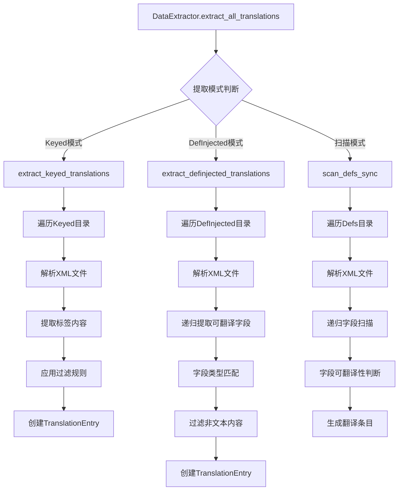
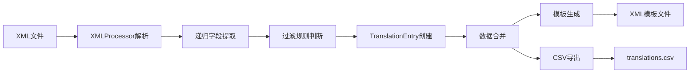

# Day_translation2 系统运行流程详细分析

## 🎯 系统架构概览

Day_translation2 是一个多层次的游戏本地化翻译工具，采用门面模式(Facade Pattern)设计，提供统一的操作接口。

### 📚 系统层次结构

```
┌─────────────────────────────────────────────────────────────┐
│                    用户交互层 (UI Layer)                      │
├─────────────────────────────────────────────────────────────┤
│  main.py (程序入口)                                          │
│  ├─ UnifiedInteractionManager (交互管理器)                   │
│  └─ 主菜单逻辑 (Menu Logic)                                  │
├─────────────────────────────────────────────────────────────┤
│                   业务逻辑层 (Business Layer)                │
├─────────────────────────────────────────────────────────────┤
│  TranslationFacade (翻译门面)                                │
│  ├─ 统一接口提供                                            │
│  ├─ 操作模式分发                                            │
│  └─ 结果封装返回                                            │
├─────────────────────────────────────────────────────────────┤
│                   核心处理层 (Core Layer)                    │
├─────────────────────────────────────────────────────────────┤
│  TemplateManager (模板管理器)                                │
│  ├─ 提取流程控制                                            │
│  ├─ 模板生成控制                                            │
│  └─ 数据导入控制                                            │
│                                                             │
│  DataExtractor (数据提取器)                                 │
│  ├─ Keyed翻译提取                                           │
│  ├─ DefInjected翻译提取                                     │
│  └─ Defs扫描提取                                            │
├─────────────────────────────────────────────────────────────┤
│                   工具支持层 (Utils Layer)                   │
├─────────────────────────────────────────────────────────────┤
│  AdvancedXMLProcessor (XML处理器)                            │
│  AdvancedFilterRules (过滤规则)                              │
│  ExportManager (导出管理器)                                  │
│  FileUtils (文件工具)                                        │
├─────────────────────────────────────────────────────────────┤
│                   数据模型层 (Model Layer)                   │
├─────────────────────────────────────────────────────────────┤
│  TranslationEntry, OperationResult, ConfigModels            │
└─────────────────────────────────────────────────────────────┘
```

## 🔄 主要运行流程

### 1. 系统启动流程



### 2. 提取模式详细流程



### 3. 数据提取核心逻辑



## 🧩 核心组件详细分析

### TranslationFacade (翻译门面)

**职责**: 提供统一的翻译操作接口，封装复杂的内部逻辑

**核心方法**:
- `extract_templates_and_generate_csv()`: 提取模板并生成CSV
- `import_translations_to_templates()`: 导入翻译到模板
- `batch_process_mods()`: 批量处理模组

**内部逻辑**:
```python
def extract_templates_and_generate_csv(self, ...):
    # 1. 参数验证
    # 2. 调用TemplateManager
    # 3. 结果封装
    # 4. 错误处理
    # 5. 返回OperationResult
```

### TemplateManager (模板管理器)

**职责**: 控制整个提取和生成流程，协调各个组件

**核心方法**:
- `extract_and_generate_templates()`: 主要提取流程
- `_extract_all_translations()`: 协调数据提取
- `_generate_templates_to_output_dir()`: 生成模板文件

**流程控制逻辑**:
```python
def extract_and_generate_templates(self, ...):
    # 步骤1: 智能选择DefInjected提取方式
    definjected_mode = self._handle_definjected_extraction_choice(...)
    
    # 步骤2: 提取翻译数据
    translations = self._extract_all_translations(definjected_mode=definjected_mode)
    
    # 步骤3: 生成翻译模板
    if output_dir:
        self._generate_templates_to_output_dir(...)
    else:
        self._generate_all_templates(...)
    
    # 步骤4: 导出CSV
    self._save_translations_to_csv(translations, csv_path)
    
    return translations
```

### DataExtractor (数据提取器)

**职责**: 从XML文件中提取可翻译的文本内容

**核心提取方法**:

1. **extract_keyed_translations()**:
```python
def extract_keyed_translations(self, keyed_dir: str) -> List[TranslationEntry]:
    # 1. 遍历Keyed目录
    # 2. 解析每个XML文件
    # 3. 提取<key>标签内容
    # 4. 应用过滤规则
    # 5. 创建TranslationEntry对象
```

2. **extract_definjected_translations()**:
```python
def extract_definjected_translations(self, definjected_dir: str) -> List[TranslationEntry]:
    # 1. 遍历DefInjected目录
    # 2. 递归扫描XML结构
    # 3. 识别可翻译字段
    # 4. 过滤非文本内容
    # 5. 生成翻译条目
```

3. **scan_defs_sync()**:
```python
def scan_defs_sync(self, defs_dir: str) -> List[TranslationEntry]:
    # 1. 遍历Defs目录
    # 2. 解析XML文件结构
    # 3. 递归字段扫描
    # 4. 判断字段可翻译性
    # 5. 创建扫描结果
```

### 递归字段提取核心逻辑

**_extract_translatable_fields_recursive()** 是最核心的算法:

```python
def _extract_translatable_fields_recursive(self, element, path="", context=""):
    """递归提取可翻译字段的核心算法"""
    
    results = []
    
    # 处理当前元素的文本内容
    if element.text and element.text.strip():
        if self.filter_rules.should_translate_field(element.tag, element.text):
            if not self.filter_rules.is_non_text_content(element.text):
                # 创建翻译条目
                entry = TranslationEntry(...)
                results.append(entry)
    
    # 递归处理子元素
    for child in element:
        child_path = f"{path}.{child.tag}" if path else child.tag
        child_results = self._extract_translatable_fields_recursive(
            child, child_path, context
        )
        results.extend(child_results)
    
    return results
```

### 过滤规则系统

**AdvancedFilterRules** 提供智能过滤:

```python
class AdvancedFilterRules:
    def should_translate_field(self, field_name: str, field_value: str = "") -> bool:
        # 1. 检查字段名是否在翻译列表中
        # 2. 检查字段值是否符合文本特征
        # 3. 应用高级过滤规则
        # 4. 返回是否应该翻译的判断
    
    def is_non_text_content(self, content: str) -> bool:
        # 1. 检查是否为数字
        # 2. 检查是否为路径
        # 3. 检查是否为代码片段
        # 4. 检查是否为特殊标记
        # 5. 返回是否为非文本内容
```

## 📊 数据流向图



## 🔧 关键算法和逻辑

### 1. DefInjected提取选择算法

```python
def _handle_definjected_extraction_choice(self, output_dir, auto_choose):
    """智能选择DefInjected提取方式"""
    if auto_choose:
        # 自动判断：检查是否存在DefInjected文件
        if self._has_definjected_files():
            return "definjected"
        else:
            return "scan"
    else:
        # 用户交互选择
        return self._prompt_user_choice()
```

### 2. 智能合并算法

```python
def export_with_smart_merge(output_file_path, translations, merge_mode):
    """智能合并翻译内容"""
    if merge_mode == "smart-merge":
        # 1. 检查现有文件
        # 2. 比较翻译条目
        # 3. 智能决策保留/覆盖
        # 4. 生成合并结果
    elif merge_mode == "overwrite":
        # 完全覆盖模式
    elif merge_mode == "preserve":
        # 保留现有内容模式
```

### 3. 并发处理优化

```python
def _extract_files_concurrently(self, file_paths):
    """并发处理多个文件"""
    with ThreadPoolExecutor(max_workers=4) as executor:
        futures = {
            executor.submit(self._extract_single_file, path): path 
            for path in file_paths
        }
        
        results = []
        for future in as_completed(futures):
            try:
                result = future.result()
                results.extend(result)
            except Exception as e:
                logging.error(f"处理文件失败: {e}")
        
        return results
```

## 🎯 性能优化特性

1. **并发处理**: 使用ThreadPoolExecutor处理多个XML文件
2. **内存管理**: 流式处理大文件，避免内存溢出
3. **缓存机制**: 缓存解析结果和过滤规则
4. **进度显示**: 使用tqdm显示处理进度

## 🛡️ 错误处理机制

1. **分层异常处理**: 
   - TranslationError: 翻译相关错误
   - ConfigError: 配置错误
   - ProcessingError: 处理错误
   - ValidationError: 验证错误

2. **错误恢复**: 
   - 单文件处理失败不影响整体流程
   - 提供错误详情和建议解决方案
   - 支持部分成功的操作结果

3. **用户友好**: 
   - 中文错误信息
   - 具体的错误上下文
   - 操作建议和帮助信息

## 📈 系统扩展性

1. **插件架构**: 支持自定义提取器和过滤器
2. **配置驱动**: 通过配置文件调整行为
3. **接口标准化**: 统一的操作接口便于扩展
4. **模块化设计**: 各组件独立，便于单独测试和替换

---

这个系统设计体现了现代软件工程的最佳实践：职责分离、接口抽象、错误处理、性能优化和用户体验。
