# Day汉化项目 - XML处理流程图权威版本

## 📋 流程图管理信息
- **创建时间**: 2025年6月21日
- **当前版本**: v2.0 (完善版)
- **维护状态**: 活跃维护中
- **最后更新**: 2025年6月21日 - 添加性能监控、错误恢复、数据验证模块
- **下次更新**: 根据测试框架建立进度同步更新

## 🎯 流程图用途和价值

### 核心价值
1. **架构权威文档**: Day汉化项目XML处理的技术架构标准
2. **开发指导**: 新功能开发和代码重构的参考依据
3. **测试蓝图**: pytest测试用例编写的功能映射基础
4. **运维手册**: 生产环境部署和监控的流程指南

### 适用场景
- 新开发者项目上手和架构理解
- 代码Review和架构设计讨论
- 测试用例设计和覆盖率规划
- 生产环境问题排查和优化
- 系统重构和功能扩展规划

## 🔧 流程图内容概览

### 核心处理流程 (6个主要阶段)
1. **文件验证阶段**: 文件存在性、大小限制检查
2. **XML解析阶段**: lxml/ElementTree解析器选择
3. **翻译提取阶段**: 元素和属性文本提取
4. **翻译更新阶段**: 基于字典的内容更新
5. **智能合并阶段**: 保留手动编辑的智能合并
6. **文件保存阶段**: 格式化XML输出保存

### 高级特性模块 (3个增强系统)
1. **性能监控系统**: 实时监控、进度回调、性能报告
2. **错误恢复机制**: 智能重试、降级处理、错误报告
3. **数据验证系统**: 多层验证、质量检查、编码验证

### 技术架构映射
- 精确对应最新的模块化重构架构
- 包含所有6个导出子模块的功能分布
- 集成pytest测试框架和CI/CD流程

## 📈 维护和更新策略

### 自动同步机制
1. **代码变更同步**: 当core/exporters模块发生重大变更时更新
2. **测试框架集成**: pytest用例增加时同步更新测试映射
3. **性能优化反馈**: 基于监控数据优化流程节点
4. **错误模式学习**: 根据实际错误情况完善恢复机制

### 版本控制策略
- **主版本更新**: 架构重大变更 (如新增核心模块)
- **次版本更新**: 功能增强 (如新增监控指标)
- **修订版更新**: 细节优化 (如流程节点调整)

### 验证和测试协议
1. **架构一致性验证**: 定期检查流程图与实际代码架构的一致性
2. **功能覆盖度检查**: 确保所有核心功能都在流程图中体现
3. **性能基准对比**: 流程图预期性能与实际监控数据对比
4. **错误场景模拟**: 验证错误恢复流程的实际有效性

## 🎯 与项目当前阶段的契合度

### 核心模块重构完成阶段 ✅
- 流程图完全映射到最新的模块化架构
- 体现了单一职责原则和清晰的功能边界
- 支持向后兼容和渐进式迁移策略

### 测试框架建立阶段 🔄
- 提供完整的pytest测试用例组织结构
- 定义了单元测试、集成测试、端到端测试的范围
- 包含性能基准测试和错误恢复测试

### 生产就绪验证阶段 ⏳
- 集成了生产级监控和告警机制
- 提供了CI/CD流程和容器化部署指南
- 包含扩展性设计和插件架构支持

## 🧠 AI记忆系统集成

### 记忆更新触发条件
1. **代码重构完成**: 自动同步架构变更
2. **测试用例增加**: 更新测试映射和覆盖度
3. **性能优化**: 基于监控数据调整流程
4. **错误模式发现**: 完善错误恢复机制
5. **用户反馈**: 根据开发者使用反馈优化

### 与其他记忆文档的关联
- **快速状态.md**: 项目整体进度与流程图版本同步
- **关键决策记录.md**: 流程设计决策的历史记录
- **问题排查手册.md**: 错误恢复流程的实际案例
- **质量工具报告**: 流程图质量检查的自动化结果

### 智能化维护能力
1. **自动检测**: 监控代码变更，自动识别需要更新的流程节点
2. **智能建议**: 基于性能数据和错误统计，提出流程优化建议
3. **版本管理**: 自动维护流程图的版本历史和变更日志
4. **质量保证**: 定期验证流程图与实际系统的一致性

## 📊 流程图使用指南

### 开发者使用场景
1. **新功能开发**: 参考流程图确定功能插入点和依赖关系
2. **代码Review**: 使用流程图验证代码逻辑的完整性
3. **性能优化**: 基于监控节点识别性能瓶颈
4. **错误排查**: 根据错误恢复流程快速定位问题

### 测试工程师使用场景
1. **测试用例设计**: 基于流程节点设计覆盖所有路径的测试
2. **集成测试规划**: 使用子图模块设计集成测试策略
3. **性能测试**: 基于性能监控节点设计基准测试
4. **错误注入测试**: 根据错误恢复流程设计故障测试

### 运维工程师使用场景
1. **监控配置**: 基于性能监控节点配置告警阈值
2. **故障诊断**: 使用错误恢复流程快速故障定位
3. **容量规划**: 基于性能数据进行资源规划
4. **部署策略**: 参考CI/CD流程优化部署流水线

这个流程图现在已经成为Day汉化项目AI记忆系统的重要组成部分，将随着项目进展持续演进和完善！🎯

## 🎯 完整流程图内容 (v2.0)

### Mermaid流程图代码

```mermaid
flowchart TD
    A[开始输入XML文件路径和新翻译字典] --> B{文件是否存在}
    B -->|否| B1[抛出异常文件不存在]
    B -->|是| C{文件大小是否超限}
    C -->|是| C1[抛出异常文件过大]
    C -->|否| D{使用lxml解析}
    D -->|是| E[lxml解析XML文件]
    D -->|否| F[ElementTree解析XML文件]
    E --> G{有Schema路径}
    G -->|是| H[Schema验证XML树]
    H -->|失败| H1[记录警告继续]
    G -->|否| I[解析完成返回XML树]
    F --> I
    H1 --> I

    I --> J[提取翻译内容]
    J --> J1[遍历XML所有元素]
    J1 --> J2{提取元素文本}
    J2 -->|是且符合条件| J3[生成元素键加入列表]
    J2 -->|否| J4{提取属性文本}
    J4 -->|是且符合条件| J5[生成属性键加入列表]
    J4 -->|否| J6[继续下一个]
    J3 --> J6
    J5 --> J6
    J6 --> J7[返回翻译条目列表]

    J7 --> K[更新翻译]
    K --> K1[遍历XML所有元素]
    K1 --> K2[生成元素键]
    K2 --> K3{键存在翻译字典}
    K3 -->|是| K4{文本不同或不合并}
    K4 -->|是| K5[更新元素文本]
    K4 -->|否| K6[跳过]
    K3 -->|否| K6
    K5 --> K7[遍历元素属性]
    K7 --> K8{属性键存在字典}
    K8 -->|是| K9[更新属性值]
    K8 -->|否| K10[跳过属性]
    K9 --> K10
    K6 --> K10
    K10 --> K11[返回修改标记]

    K11 --> L[智能合并翻译]
    L --> L1{文件存在}
    L1 -->|否| L2[创建新XML文件]
    L1 -->|是| L3[解析XML文件]
    L3 --> L4[收集翻译键映射]
    L4 --> L5[遍历现有键]
    L5 --> L6{键在新翻译中}
    L6 -->|是| L7{保留手动编辑}
    L7 -->|是| L8{旧文本是机器翻译}
    L8 -->|是| L9[替换为新翻译]
    L8 -->|否| L10[保留旧文本]
    L7 -->|否| L9
    L6 -->|否| L10
    L9 --> L11[计数更新]
    L10 --> L11
    L11 --> L12[遍历新翻译字典]
    L12 --> L13{新键存在旧XML}
    L13 -->|否| L14[添加新元素]
    L13 -->|是| L15[跳过添加]
    L14 --> L15
    L15 --> L16[保存XML文件]
    L16 --> L17[返回合并结果]

    subgraph Performance [性能监控和日志]
        P1[开始性能计时]
        P2[记录操作日志]
        P3[内存使用监控]
        P4[处理进度回调]
        P5[生成性能报告]
    end

    subgraph ErrorRecovery [错误恢复机制]
        E1[检测错误类型]
        E2{是否可重试}
        E3[自动重试计数]
        E4[降级处理策略]
        E5[生成错误报告]
    end

    subgraph DataValidation [数据验证]
        V1[输入数据校验]
        V2[翻译质量检查]
        V3[XML结构验证]
        V4[字符编码检查]
        V5[输出数据校验]
    end

    A --> P1
    P1 --> P2
    I --> P3
    K --> P4
    L17 --> P5

    B1 --> E1
    C1 --> E1
    H -->|失败| E1
    E1 --> E2
    E2 -->|是| E3
    E2 -->|否| E4
    E3 -->|重试次数未超限| H
    E3 -->|重试次数超限| E4
    E4 --> E5
    E5 --> ENDERROR

    A --> V1
    J7 --> V2
    I --> V3
    V1 --> V4
    L17 --> V5

    classDef performanceNode fill:#e6f3ff,stroke:#0080ff,stroke-width:2px
    classDef validationNode fill:#fff2e6,stroke:#ff8000,stroke-width:2px
    classDef recoveryNode fill:#ffe6f3,stroke:#ff0080,stroke-width:2px
    classDef errorNode fill:#ffcccc,stroke:#ff0000,stroke-width:2px
    classDef successNode fill:#ccffcc,stroke:#00ff00,stroke-width:2px
    classDef processNode fill:#cceeff,stroke:#0066cc,stroke-width:2px
    classDef decisionNode fill:#ffffcc,stroke:#ffcc00,stroke-width:2px

    class P1,P2,P3,P4,P5 performanceNode
    class V1,V2,V3,V4,V5 validationNode
    class E1,E2,E3,E4,E5 recoveryNode
    class B1,C1,ENDERROR errorNode
    class ENDSUCCESS,M7 successNode
    class A,I,J,K,L,M1 processNode
    class B,C,D,G,H,L1,L6,L7,L8,L13,M2,M5 decisionNode
```


### 核心处理阶段详解
1. **文件验证阶段** (A→B→C): 文件存在性和大小限制检查
2. **XML解析阶段** (D→E/F→G→H→I): lxml/ElementTree解析器选择和Schema验证
3. **翻译提取阶段** (J→J7): 遍历XML提取翻译内容
4. **翻译更新阶段** (K→K11): 基于字典更新XML内容
5. **智能合并阶段** (L→L17): 保留手动编辑的智能合并
6. **文件保存阶段** (L16→SaveXML): 格式化XML输出保存

### 高级特性模块详解
1. **性能监控系统** (Performance): 实时监控、进度回调、性能报告
2. **错误恢复机制** (ErrorRecovery): 智能重试、降级处理、错误报告
3. **数据验证系统** (DataValidation): 多层验证、质量检查、编码验证

## 🔧 系统验证和同步机制

### 自动验证脚本
```python
# validate_xml_flow_consistency.py
def validate_flow_consistency():
    """验证流程图与实际代码架构的一致性"""

    # 1. 检查模块映射一致性
    expected_modules = [
        'core/exporters/xml_generators.py',
        'core/exporters/export_utils.py',
        'core/xml_handlers.py',
        'utils/file_utils.py',
        'models/exceptions.py',
        'models/result_models.py',
        'utils/validation.py',
        'utils/logger.py',
        'utils/performance.py'
    ]

    # 2. 验证函数覆盖度
    flow_functions = [
        'parse_xml_file',
        'extract_translations',
        'update_translations',
        'smart_merge_xml_translations',
        'save_xml_file'
    ]

    # 3. 性能指标验证
    performance_metrics = [
        'processing_time',
        'memory_usage',
        'error_rate',
        'success_rate'
    ]

    return validation_results

### 触发条件监控
def monitor_update_triggers():
    """监控需要更新流程图的触发条件"""

    triggers = {
        'code_changes': [
            'core/exporters/**/*.py',
            'models/**/*.py',
            'utils/**/*.py'
        ],
        'test_changes': [
            'tests/**/*.py',
            'pytest.ini',
            'conftest.py'
        ],
        'config_changes': [
            'config/**/*.py',
            'constants/**/*.py'
        ]
    }

    return triggers
```

### 智能更新建议系统
```python
def generate_flow_update_suggestions():
    """基于代码变更生成流程图更新建议"""

    suggestions = {
        'new_nodes': [],      # 新增节点建议
        'modified_edges': [], # 修改连接建议
        'deprecated_nodes': [], # 废弃节点建议
        'performance_optimizations': [] # 性能优化建议
    }

    return suggestions
```
