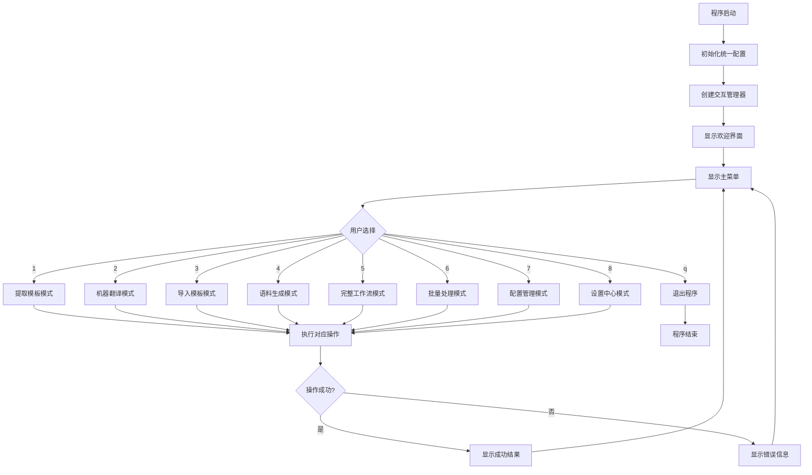
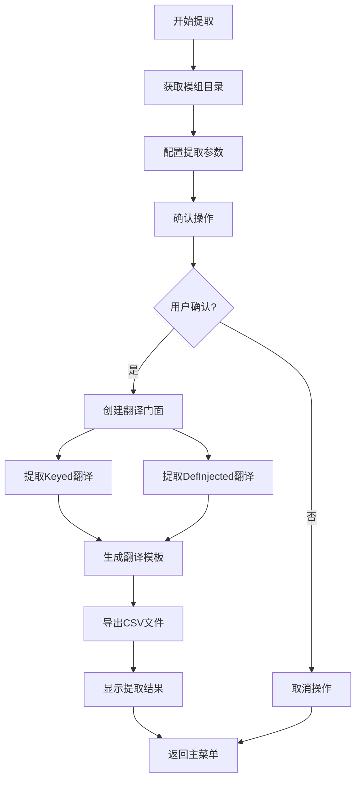
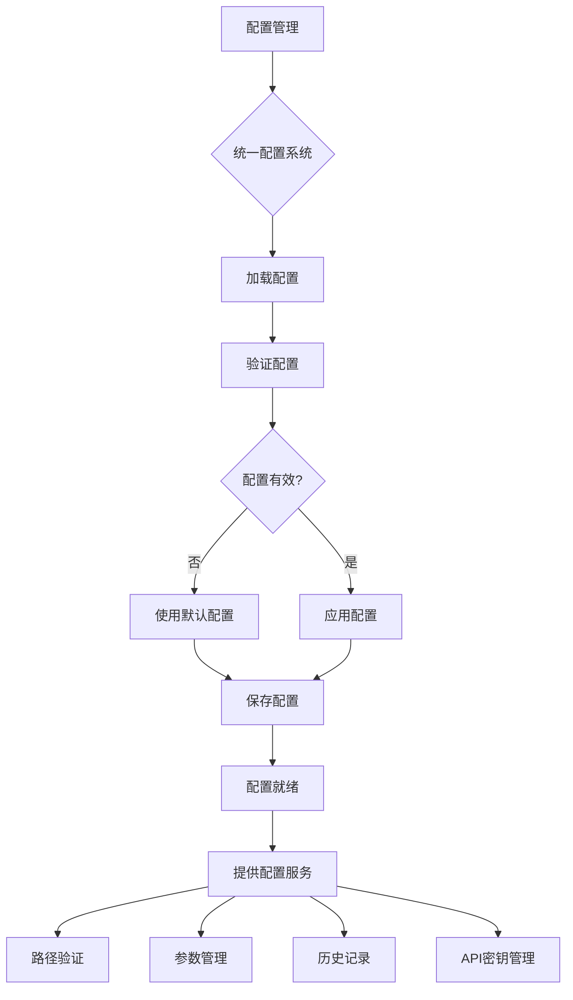
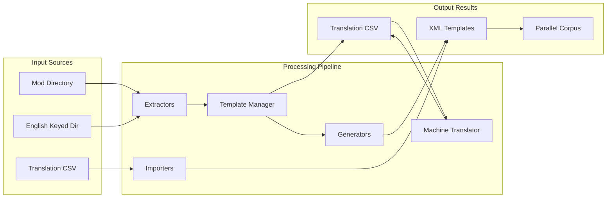
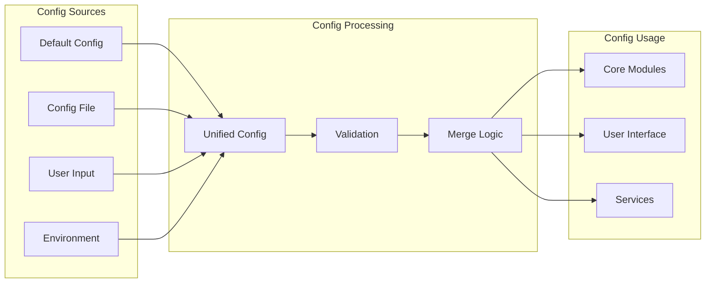
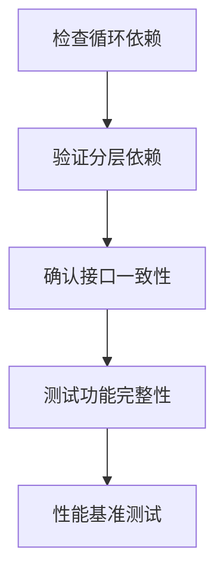

# Day Translation 重构架构图表集

**创建时间：** 2025年6月18日  
**目标：** 为 Day_translation2 重构提供清晰的架构指导  
**重构原则：** 统一接口、消除重复、清晰分层  

## 📐 1. 系统架构框架图

### 1.1 目标架构（重构后）

```
Day_translation2/
├── 📁 core/                           # 核心业务层
│   ├── 🎯 main.py                     # 主程序入口（修复后）
│   ├── 🏭 translation_facade.py      # 翻译门面模式
│   ├── 📝 template_manager.py        # 模板管理器
│   ├── 📤 extractors.py              # 数据提取器
│   ├── 📥 importers.py               # 数据导入器
│   ├── 📦 exporters.py               # 数据导出器
│   └── 🔧 generators.py              # 模板生成器
├── 📁 config/                         # 配置层（统一）
│   ├── 🎛️ unified_config.py          # 统一配置管理
│   └── 📋 config_schemas.py          # 配置模式定义
├── 📁 interaction/                    # 交互层（统一）
│   ├── 💬 unified_interaction.py     # 统一交互管理
│   ├── 📺 menu_system.py             # 菜单系统
│   └── 🎨 display_utils.py           # 显示工具
├── 📁 services/                       # 服务层
│   ├── 🔄 batch_processor.py         # 批量处理服务
│   ├── 🌐 machine_translate.py       # 机器翻译服务
│   ├── 📚 corpus_generator.py        # 语料生成服务
│   └── 🔍 validation_service.py      # 验证服务
├── 📁 utils/                          # 工具层
│   ├── 📄 xml_processor.py           # XML处理工具
│   ├── 🗂️ file_utils.py              # 文件操作工具
│   ├── 🛡️ filters.py                 # 内容过滤器
│   ├── 📝 history_manager.py         # 历史记录管理
│   └── 🚨 exception_handler.py       # 异常处理器
└── 📁 models/                         # 数据模型层
    ├── 📊 translation_data.py        # 翻译数据模型
    ├── ⚙️ config_models.py           # 配置数据模型
    └── 📈 result_models.py           # 结果数据模型
```

### 1.2 分层职责

| 层级 | 职责 | 依赖关系 |
|------|------|----------|
| **Core** | 核心业务逻辑，翻译流程控制 | 依赖 Config, Interaction, Services |
| **Config** | 统一配置管理，参数验证 | 依赖 Models |
| **Interaction** | 用户交互，界面显示 | 依赖 Config, Models |
| **Services** | 独立的业务服务 | 依赖 Utils, Models |
| **Utils** | 通用工具函数 | 依赖 Models |
| **Models** | 数据模型定义 | 无依赖（基础层） |

## 🔄 2. 主要业务流程图

### 2.1 程序启动流程



### 2.2 提取模板流程（示例）



### 2.3 配置管理流程



## 🔧 3. 核心函数关系图

### 3.1 主流程函数图

```mermaid
graph TB
    subgraph "Main Module"
        MAIN[main()]
        TF[TranslationFacade]
        
        HEM[handle_extraction_mode()]
        HTM[handle_translation_mode()]
        HIM[handle_import_mode()]
        HCM[handle_corpus_mode()]
        HCWM[handle_complete_workflow_mode()]
        HBPM[handle_batch_processing_mode()]
        HSM[handle_settings_mode()]
    end
    
    subgraph "Unified Interaction"
        UIM[UnifiedInteractionManager]
        SW[show_welcome()]
        SMM[show_main_menu()]
        GMD[get_mod_directory()]
        CEO[configure_extraction_operation()]
        SOR[show_operation_result()]
        CO[confirm_operation()]
        HSMenu[handle_settings_menu()]
    end
    
    subgraph "Translation Facade"
        ETAGC[extract_templates_and_generate_csv()]
        ITTT[import_translations_to_templates()]
        GC[generate_corpus()]
        MT[machine_translate()]
        GAK[_get_api_key()]
        VC[_validate_config()]
    end
    
    MAIN --> UIM
    MAIN --> TF
    MAIN --> HEM
    MAIN --> HTM
    MAIN --> HIM
    MAIN --> HCM
    MAIN --> HCWM
    MAIN --> HBPM
    MAIN --> HSM
    
    HEM --> CEO
    HEM --> ETAGC
    HEM --> SOR
    
    HTM --> MT
    HTM --> SOR
    
    HIM --> ITTT
    HIM --> SOR
    
    UIM --> SW
    UIM --> SMM
    UIM --> GMD
    UIM --> CEO
    UIM --> SOR
    UIM --> CO
    UIM --> HSMenu
    
    TF --> ETAGC
    TF --> ITTT
    TF --> GC
    TF --> MT
    TF --> GAK
    TF --> VC
```

### 3.2 配置系统函数图

```mermaid
graph TB
    subgraph "Unified Config System"
        UC[UnifiedConfig]
        GC[get_config()]
        SC[save_config()]
        RC[reset_config()]
        GCP[get_config_path()]
    end
    
    subgraph "Config Components"
        CC[CoreConfig]
        EP[ExtractionPreferences]
        IP[ImportPreferences]
        AP[ApiPreferences]
        GP[GeneralPreferences]
        UCFG[UserConfig]
    end
    
    subgraph "Path Management"
        GPWV[get_path_with_validation()]
        RP[remember_path()]
        GRP[get_remembered_path()]
        VP[_validate_path()]
    end
    
    GC --> UC
    SC --> UC
    RC --> UC
    
    UC --> CC
    UC --> UCFG
    
    UCFG --> EP
    UCFG --> IP
    UCFG --> AP
    UCFG --> GP
    
    UC --> GPWV
    UC --> RP
    UC --> GRP
    UC --> VP
```

### 3.3 核心业务函数图

```mermaid
graph TB
    subgraph "Template Manager"
        TM[TemplateManager]
        EAGT[extract_and_generate_templates()]
        IT[import_translations()]
        EAT[_extract_all_translations()]
        GTTOD[_generate_templates_to_output_dir()]
        STTC[_save_translations_to_csv()]
    end
    
    subgraph "Extractors"
        EKT[extract_keyed_translations()]
        SDS[scan_defs_sync()]
        EDT[extract_definjected_translations()]
        ETFR[_extract_translatable_fields_recursive()]
    end
    
    subgraph "Generators"
        TG[TemplateGenerator]
        GKT[generate_keyed_template()]
        GDT[generate_definjected_template()]
        GKTFD[generate_keyed_template_from_data()]
    end
    
    subgraph "Importers & Exporters"
        UAX[update_all_xml()]
        ITFunc[import_translations()]
        LTFC[load_translations_from_csv()]
        ED[export_definjected()]
        EK[export_keyed()]
    end
    
    TM --> EAGT
    TM --> IT
    TM --> EAT
    TM --> GTTOD
    TM --> STTC
    
    EAGT --> EKT
    EAGT --> SDS
    EAGT --> EDT
    
    EKT --> ETFR
    SDS --> ETFR
    EDT --> ETFR
    
    GTTOD --> TG
    TG --> GKT
    TG --> GDT
    TG --> GKTFD
    
    IT --> UAX
    IT --> LTFC
    
    STTC --> ED
    STTC --> EK
```

## 🔀 4. 数据流图

### 4.1 翻译数据流



### 4.2 配置数据流



## 🚨 5. 重构关键点检查清单

### 5.1 接口统一检查

| 检查项 | 原始问题 | 重构目标 | 验证方法 |
|--------|----------|----------|----------|
| `show_operation_result()` 调用 | 参数不匹配 | 统一参数格式 | 运行测试 |
| `handle_preferences_menu()` | 方法不存在 | 改为 `handle_settings_menu()` | 检查调用点 |
| `confirm_operation()` | 重复实现 | 统一到 UnifiedInteractionManager | 移除重复代码 |
| 配置系统调用 | 新旧混用 | 统一使用 UnifiedConfig | 全局搜索替换 |

### 5.2 架构层级检查

| 层级 | 检查项 | 标准 |
|------|--------|------|
| Core | 不直接处理UI | 通过 Interaction 层 |
| Config | 单一配置入口 | 只有 UnifiedConfig |
| Interaction | 统一界面风格 | 统一显示格式 |
| Services | 服务独立性 | 可单独测试 |
| Utils | 无状态函数 | 纯函数为主 |

### 5.3 函数依赖检查



## 📋 6. 重构实施指南

### 6.1 Phase 1: 框架搭建
1. ✅ 创建目录结构
2. ✅ 定义数据模型
3. ✅ 实现统一配置
4. ✅ 实现统一交互

### 6.2 Phase 2: 核心迁移
1. 🔄 迁移 TranslationFacade
2. 🔄 修复 main.py 接口调用
3. 🔄 迁移模板管理器
4. 🔄 迁移数据处理模块

### 6.3 Phase 3: 服务整合
1. ⏳ 整合批量处理
2. ⏳ 整合机器翻译
3. ⏳ 整合语料生成
4. ⏳ 添加验证服务

### 6.4 Phase 4: 测试验证
1. ⏳ 单元测试
2. ⏳ 集成测试
3. ⏳ 用户验收测试
4. ⏳ 性能测试

## 🎯 7. 成功标准

### 7.1 功能标准
- ✅ 所有原有功能正常工作
- ✅ 无接口调用错误
- ✅ 配置系统统一
- ✅ 用户体验保持一致

### 7.2 代码质量标准
- ✅ 无重复代码
- ✅ 清晰的分层架构
- ✅ 统一的命名规范
- ✅ 完整的错误处理

### 7.3 维护性标准
- ✅ 模块职责单一
- ✅ 依赖关系清晰
- ✅ 易于扩展新功能
- ✅ 便于单元测试

---

**图表集创建完成时间：** 2025年6月18日  
**用途：** Day_translation2 重构指导文档  
**更新频率：** 随重构进度更新
