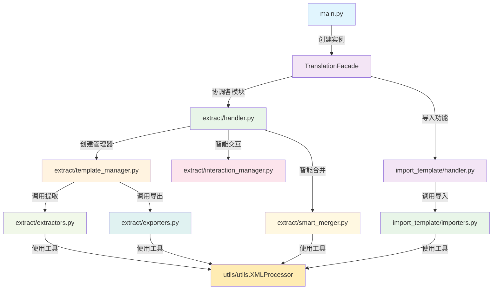

# Day Translation Core 模块架构文档

## 📋 概述

`day_translation` 工具是一个专为 RimWorld 模组设计的翻译工具包，采用模块化架构，包含翻译数据的提取、处理、生成、导出和导入功能。该工具支持多种翻译工作流程，提供智能合并、模板生成等高级功能。

## 🏗️ 项目架构

```
day_translation/
├── core/                    # 核心业务逻辑层
│   ├── translation_facade.py   # 翻译门面 - 统一接口
│   └── exceptions.py           # 异常定义
├── extract/                 # 提取模块 - 数据提取和模板生成
│   ├── extractors.py          # 提取器 - 从模组文件提取内容
│   ├── exporters.py           # 导出器 - 导出翻译文件
│   ├── template_manager.py    # 模板管理器 - 核心控制器
│   ├── handler.py             # 处理器 - 主要业务流程
│   ├── interaction_manager.py # 交互管理器 - 用户交互逻辑
│   └── smart_merger.py        # 智能合并器 - 翻译合并逻辑
├── import_template/         # 导入模块
│   ├── importers.py           # 导入器 - CSV到XML转换
│   └── handler.py             # 导入处理器
├── utils/                   # 工具模块
│   ├── config.py              # 配置管理
│   ├── utils.py               # 工具函数和XMLProcessor
│   ├── filters.py             # 内容过滤器
│   └── interaction.py         # 交互工具
└── main.py                  # 主入口
```

## 📊 模块调用关系图




**调用关系**:
```python
TemplateManager
├── 调用 extractors.py 的提取函数
│   ├── extract_keyed_translations(language=language)
│   ├── scan_defs_sync()  # 不需要language参数
│   └── extract_definjected_translations(language=language)
├── 调用 exporters.py 的导出函数
│   ├── export_definjected_with_original_structure()
│   ├── export_definjected_with_defs_structure()
│   └── export_definjected_with_file_structure()
└── 统一返回五元组格式 (key, test, tag, rel_path, en_test)
```

### 4. extract/extractors.py - 内容提取器

**职责**: 
- 从模组文件中提取可翻译内容
- 解析XML文件结构
- 支持多种语言的内容提取

**主要函数**:
- `extract_keyed_translations(mod_dir, language)`: 提取指定语言的Keyed翻译
- `scan_defs_sync(mod_dir)`: 扫描Defs定义文件（语言无关）
- `extract_definjected_translations(mod_dir, language)`: 提取指定语言的DefInjected翻译

**关键改进**:
- 移除了 `direct_dir` 参数，统一使用 `language` 参数
- 所有函数现在返回统一的五元组格式
- 基于语言参数自动构建正确的路径

### 5. extract/exporters.py - 翻译导出器

**职责**: 
- 导出翻译文件到指定结构
- 支持多种导出格式和结构
- XML文件的创建和更新

**主要函数**:
- `export_definjected_with_original_structure()`: 按原始文件路径结构导出
- `export_definjected_with_defs_structure()`: 按DefType分类导出
- `export_definjected_with_file_structure()`: 按文件目录结构导出
- `write_merged_definjected_translations()`: 智能合并并导出翻译


### 流程1: 提取模板并生成CSV

```python
# 用户操作: 模式1 - 生成模板和CSV
main() 
└── TranslationFacade.extract_templates_and_generate_csv()
    └── TemplateManager.extract_and_generate_templates()
        ├── _extract_all_translations()
        │   ├── extract_keyed_translations()      # 提取Keyed翻译
        │   ├── scan_defs_sync()                  # 扫描Defs文件
        │   └── extract_definjected_translations() # 提取DefInjected翻译
        ├── _generate_all_templates() 或 _generate_templates_to_output_dir()
        │   ├── TemplateGenerator.generate_keyed_template() # 生成Keyed模板
        │   ├── TemplateGenerator.generate_keyed_template_from_data() # 从数据生成Keyed模板
        │   ├── TemplateGenerator.generate_definjected_template() # 生成DefInjected模板
        │   └── TemplateGenerator.generate_definjected_template_from_data() # 从数据生成DefInjected模板
        ├── _export_translations_to_csv()         # 导出翻译到CSV
        │   └── _handle_definjected_structure_choice()        # 处理DefInjected结构选择
        │       ├── export_definjected_with_original_structure()          # 按原始文件路径结构导出
        │       ├── export_definjected_with_defs_structure()      # 按DefType分类导出 
        │       └── TemplateGenerator.generate_definjected_template()             # 获取DefInjected模板
        └── _save_translations_to_csv()         # 保存翻译到CSV
```

### 流程2: 导入翻译到模板

```python
# 用户操作: 模式3 - 导入翻译
main()
└── TranslationFacade.import_translations_to_templates()
    └── TemplateManager.import_translations()
        ├── _validate_csv_file()           # 验证CSV文件
        ├── _load_translations_from_csv()  # 加载翻译数据
        ├── _update_all_xml_files()        # 更新XML文件
        │   └── XMLProcessor.update_translations()
        └── _verify_import_results()       # 验证导入结果
```

### 流程3: DefInjected结构选择

```python
# 智能结构选择流程
_handle_definjected_structure_choice()
├── 检测英文DefInjected目录存在性
├── 显示用户选择界面
└── 根据选择执行不同导出策略:
    ├── 选择1: export_definjected_with_original_structure()
    ├── 选择2: export_definjected_with_defs_structure()
    └── 选择3: TemplateGenerator.generate_definjected_template()
```

Day Translation Core 模块采用了清晰的分层架构和模块化设计，通过合理的职责分离和接口设计，实现了高内聚、低耦合的代码结构。这种设计不仅便于维护和扩展，还为用户提供了灵活、强大的翻译处理能力。

每个模块都有明确的职责和边界，通过 `TemplateManager` 作为核心控制器协调各个子模块的工作，形成了完整而高效的翻译处理流水线。
