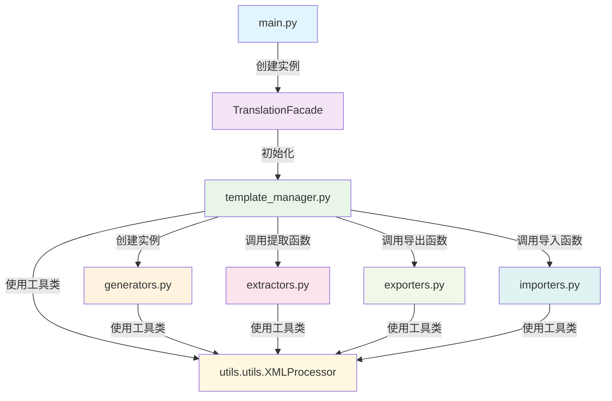

# Day Translation Core 模块架构文档

## 📋 概述

`day_translation.core` 模块是 RimWorld 模组汉化工具的核心业务逻辑层，负责翻译数据的提取、处理、生成和导入。该模块采用清晰的分层架构和模块化设计，确保代码的可维护性和扩展性。

## 🏗️ 模块架构

```
day_translation/core/
├── main.py                # 主入口 - 用户界面和外观模式
├── template_manager.py    # 模板管理器 - 核心控制器
├── extractors.py          # 提取器 - 从模组文件提取翻译内容
├── generators.py          # 生成器 - 生成翻译模板文件
├── exporters.py           # 导出器 - 导出和转换功能
├── importers.py           # 导入器 - 导入翻译到模板
└── __init__.py            # 模块初始化
```

## 📊 模块调用关系图



## 🔍 详细模块分析

### 1. main.py - 主入口和外观模式

**职责**: 
- 程序主入口
- 用户交互界面
- 外观模式实现，简化复杂操作

**核心类**:
- `TranslationFacade`: 外观类，提供简化的高级接口

**主要功能**:
- 用户输入处理和验证
- 调用其他模块完成具体任务
- 错误处理和用户友好的消息显示

**调用关系**:
```python
# 主入口调用
main() -> TranslationFacade -> TemplateManager

# 主要方法调用链
TranslationFacade.extract_templates_and_generate_csv()
├── TemplateManager.extract_and_generate_templates()
└── 其他业务方法...
```

### 2. template_manager.py - 核心控制器

**职责**: 
- 翻译模板的完整生命周期管理
- 协调各个子模块的工作
- 业务流程控制

**核心类**:
- `TemplateManager`: 模板管理器主类

**主要方法**:
- `extract_and_generate_templates()`: 提取和生成模板
- `import_translations()`: 导入翻译
- `ensure_templates_exist()`: 确保模板存在

**调用关系**:
```python
TemplateManager
├── 初始化时创建 TemplateGenerator 实例
├── 调用 extractors.py 的提取函数
│   ├── extract_keyed_translations()
│   ├── scan_defs_sync()
│   └── extract_definjected_translations()
├── 调用 generators.py 的生成方法
│   ├── generate_keyed_template()
│   ├── generate_keyed_template_from_data()
│   └── generate_definjected_template()
├── 调用 exporters.py 的导出函数
│   ├── handle_extract_translate()
│   ├── export_definjected_with_original_structure()
│   └── export_definjected_with_defs_structure()
└── 调用 importers.py 的导入函数
    └── update_all_xml()
```

### 3. extractors.py - 文本提取器

**职责**: 
- 从模组文件中提取可翻译文本
- 解析XML文件结构
- 内容过滤和筛选

**主要函数**:
- `extract_keyed_translations()`: 提取Keyed翻译
- `scan_defs_sync()`: 扫描Defs定义文件
- `extract_definjected_translations()`: 提取DefInjected翻译
- `_extract_translatable_fields_recursive()`: 递归提取可翻译字段

**调用关系**:
```python
# 被调用者
template_manager.py -> extractors.py

# 依赖关系
extractors.py
├── 使用 XMLProcessor 解析XML
├── 使用 ContentFilter 过滤内容
└── 使用 get_language_folder_path 获取路径
```

### 4. generators.py - 模板生成器

**职责**: 
- 生成翻译模板文件
- 创建XML文件结构
- 管理模板输出目录

**核心类**:
- `TemplateGenerator`: 模板生成器主类

**主要方法**:
- `generate_keyed_template()`: 生成Keyed模板
- `generate_keyed_template_from_data()`: 从数据生成Keyed模板
- `generate_definjected_template()`: 生成DefInjected模板

**调用关系**:
```python
# 被调用者
template_manager.py -> generators.py

# 内部调用链
TemplateGenerator
├── get_template_base_dir() - 获取模板基础目录
├── _create_keyed_xml_from_source() - 从源创建Keyed XML
├── _create_keyed_xml_from_data() - 从数据创建Keyed XML
├── _create_definjected_xml_from_data() - 从数据创建DefInjected XML
├── _group_translations_by_file() - 按文件分组翻译
├── _group_defs_by_type() - 按类型分组Defs
└── _get_target_file_path() - 获取目标文件路径
```

### 5. exporters.py - 导出器

**职责**: 
- 导出翻译数据为不同格式
- 处理不同的导出结构选择
- 文件转换和格式化

**主要函数**:
- `export_definjected()`: 核心DefInjected导出函数
- `export_definjected_with_original_structure()`: 按原结构导出
- `export_definjected_with_defs_structure()`: 按Defs结构导出
- `export_keyed()`: 导出Keyed翻译
- `handle_extract_translate()`: 处理提取翻译的主入口

**调用关系**:
```python
# 被调用者
template_manager.py -> exporters.py

# 主要调用链
handle_extract_translate()
├── export_keyed() - 导出Keyed翻译
├── export_definjected_from_english() - 从英文导出DefInjected
└── cleanup_backstories_dir() - 清理背景目录

export_definjected()
├── process_def_file() - 处理Def文件
└── save_xml_to_file() - 保存XML文件
```

### 6. importers.py - 导入器

**职责**: 
- 导入翻译数据到模板文件
- 更新XML文件内容
- CSV数据处理

**主要函数**:
- `import_translations()`: 导入翻译主函数
- `update_all_xml()`: 更新所有XML文件
- `load_translations_from_csv()`: 从CSV加载翻译

**调用关系**:
```python
# 被调用者
template_manager.py -> importers.py

# 调用链
import_translations()
├── load_translations_from_csv() - 加载CSV数据
└── update_all_xml() - 更新XML文件
    └── XMLProcessor.update_translations() - 更新翻译内容
```

## 🔄 典型业务流程

### 流程1: 提取模板并生成CSV

```python
# 用户操作: 模式1 - 生成模板和CSV
main() 
└── TranslationFacade.extract_templates_and_generate_csv()
    └── TemplateManager.extract_and_generate_templates()
        ├── _extract_all_translations()
        │   ├── extract_keyed_translations()      # 提取Keyed翻译
        │   ├── scan_defs_sync()                  # 扫描Defs文件
        │   └── extract_definjected_translations() # 提取DefInjected翻译
        ├── _generate_all_templates() 或 _generate_templates_to_output_dir()
        │   ├── TemplateGenerator.generate_keyed_template()
        │   ├── TemplateGenerator.generate_keyed_template_from_data()
        │   └── _handle_definjected_structure_choice()
        │       ├── export_definjected_with_original_structure()
        │       ├── export_definjected_with_defs_structure()
        │       └── TemplateGenerator.generate_definjected_template()
        └── _save_translations_to_csv()
```

### 流程2: 导入翻译到模板

```python
# 用户操作: 模式3 - 导入翻译
main()
└── TranslationFacade.import_translations_to_templates()
    └── TemplateManager.import_translations()
        ├── _validate_csv_file()           # 验证CSV文件
        ├── _load_translations_from_csv()  # 加载翻译数据
        ├── _update_all_xml_files()        # 更新XML文件
        │   └── XMLProcessor.update_translations()
        └── _verify_import_results()       # 验证导入结果
```

### 流程3: DefInjected结构选择

```python
# 智能结构选择流程
_handle_definjected_structure_choice()
├── 检测英文DefInjected目录存在性
├── 显示用户选择界面
└── 根据选择执行不同导出策略:
    ├── 选择1: export_definjected_with_original_structure()
    ├── 选择2: export_definjected_with_defs_structure()
    └── 选择3: TemplateGenerator.generate_definjected_template()
```

## 🔧 关键设计模式

### 1. 外观模式 (Facade Pattern)
- `TranslationFacade` 类简化了复杂的子系统调用
- 为用户提供统一的高级接口

### 2. 策略模式 (Strategy Pattern)
- DefInjected导出支持多种结构策略
- 用户可选择不同的导出方式

### 3. 模板方法模式 (Template Method Pattern)
- `TemplateManager` 定义了翻译处理的标准流程
- 各个子步骤可以灵活替换和扩展

### 4. 工厂模式 (Factory Pattern)
- `TemplateGenerator` 根据不同类型创建相应的XML模板

## 🌟 架构优势

### 1. **模块化设计**
- 每个模块职责单一，易于理解和维护
- 模块间通过明确的接口通信

### 2. **可扩展性**
- 新的导出格式可以通过添加新的导出器实现
- 新的提取规则可以通过扩展提取器实现

### 3. **可测试性**
- 模块间依赖明确，易于进行单元测试
- 每个函数功能独立，测试覆盖率高

### 4. **用户友好**
- 外观模式简化了复杂操作
- 丰富的交互选择和错误提示

### 5. **配置灵活**
- 支持多种输出模式和结构选择
- 配置与业务逻辑分离

## 🚀 扩展建议

### 1. **添加新的导出格式**
```python
# 在 exporters.py 中添加新函数
def export_to_json(translations, output_path):
    """导出为JSON格式"""
    pass
```

### 2. **支持新的翻译源**
```python
# 在 extractors.py 中添加新函数
def extract_from_database(connection_string):
    """从数据库提取翻译"""
    pass
```

### 3. **增强批量处理能力**
```python
# 在 template_manager.py 中添加新方法
def batch_process_mods(mod_directories):
    """批量处理多个模组"""
    pass
```

## 📚 总结

Day Translation Core 模块采用了清晰的分层架构和模块化设计，通过合理的职责分离和接口设计，实现了高内聚、低耦合的代码结构。这种设计不仅便于维护和扩展，还为用户提供了灵活、强大的翻译处理能力。

每个模块都有明确的职责和边界，通过 `TemplateManager` 作为核心控制器协调各个子模块的工作，形成了完整而高效的翻译处理流水线。
