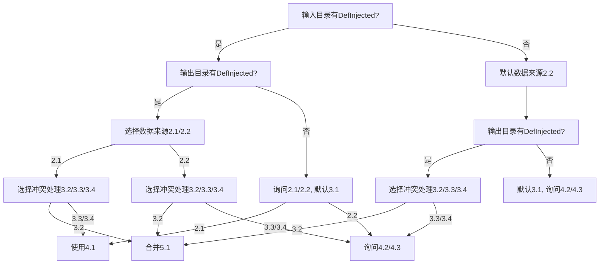
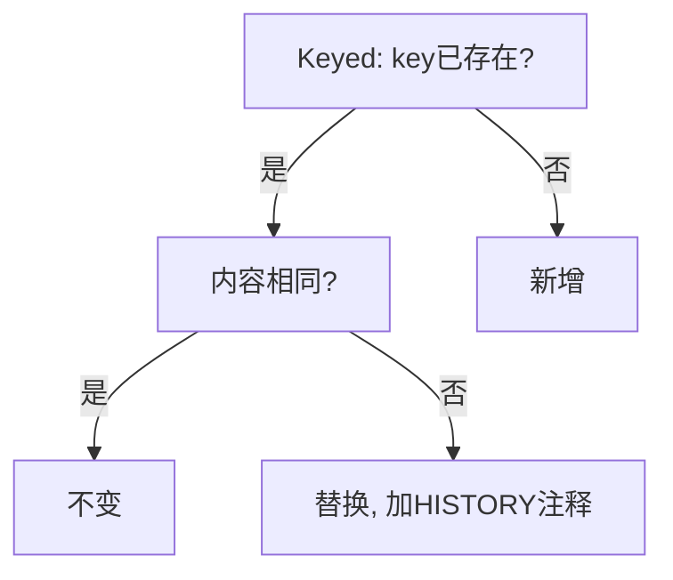

# 智能合并流程决策树

## 目录判定标准
- 只有当目录存在且其中有至少一个 `.xml` 文件时，才认为"有 DefInjected"或"有 Keyed"。
  - 代码建议：`os.path.isdir(path)` 且 `len(list(Path(path).rglob('*.xml'))) > 0`

---

## 1. 输入/输出目录状态
- 1.1 输入是否有 DefInjected
- 1.2 输出是否有 DefInjected

---

## 2. 选择数据来源（data_source_choice）
- 2.1 definjected_only - 仅使用英文 DefInjected 目录
- 2.2 defs_only - 扫描 Defs 文件夹提取

---

## 3. 处理输出冲突（conflict_resolution）
- 3.1 new - 新建
- 3.2 merge - 合并现有文件
- 3.3 overwrite - 覆盖现有文件
- 3.4 rebuild - 清空重建

---

## 4. 选择模板结构（template_structure）
- 4.1 original_structure - 保持原英文 DefInjected 结构
- 4.2 defs_by_type - 按定义类型分组（如 ThingDefs.xml、PawnKindDefs.xml 等）
- 4.3 defs_by_file_structure - 按原始 Defs 文件结构组织

---

## 5.1 合并逻辑
- ekey == okey 且 otest == eEN：不更改
- ekey == okey 且 otest != eEN：otest 替换 etest，**保留历史注释**，EN注释始终保留且与最新英文同步
- ekey 不存在：新增

### 合并时注释格式示例
```xml
<!--HISTORY: 原翻译内容：旧内容，替换于2024-06-07-->
<!--EN: 新英文原文-->
<key>新内容</key>
```
- EN注释（`<!--EN: ...-->`）始终要有，内容与最新 otest 保持同步。
- 历史注释可放在 EN 注释之前。

---

## 6.1 合并提取逻辑
- 合并时**以输出目录为主**，输入目录（新提取的数据）为增量/更新。
- 遍历输出目录 DefInjected 的 key，和输入目录新提取的 key 进行比对，按 5.1 逻辑处理。
- 新增的 key 也要插入到输出目录的 XML 文件中，并带上 EN 注释。

- 如果选择 2.1：
    - 使用 2.1 作为数据来源，提取输出目录 DefInjected 的 key 和 test，使用 5.1 合并逻辑
- 如果选择 2.2：
    - 使用 2.2 作为数据来源，提取输出目录 DefInjected 的 key 和 test，使用 5.1 合并逻辑

---

## 决策流程

### 情况一：输入有 DefInjected，输出有 DefInjected
- 询问：2.1/2.2
    - 选择 2.1：
        - 询问：3.2/3.3/3.4
            - 选择 3.2：使用 5.1
            - 选择 3.3/3.4：使用 4.1
    - 选择 2.2：
        - 询问：3.2/3.3/3.4
            - 选择 3.2：使用 5.1
            - 选择 3.3/3.4：询问 4.2/4.3

### 情况二：输入有 DefInjected，输出无 DefInjected
- 询问：2.1/2.2，默认 3.1
    - 选择 2.1：使用模板 4.1
    - 选择 2.2：询问 4.2/4.3

### 情况三：输入无 DefInjected，输出有 DefInjected
- 默认 2.2，询问 3.2/3.3/3.4
    - 选择 3.2：使用 5.1（从 2.2 提取数据，检查输出目录 DefInjected 的 key 和 test）
    - 选择 3.3/3.4：询问 4.2/4.3

### 情况四：输入无 DefInjected，输出无 DefInjected
- 默认 2.2，默认 3.1，询问 4.2/4.3

---

## 流程图



---

## 示例

> 输出目录提取的 DefInjected
> ```xml
> <!--EN: Chatty Nymph-->
> <rjw_chatty.title>健谈的仙女</rjw_chatty.title>
> ```
> eEN = Chatty Nymph
> ekey = rjw_chatty.title
> etest = 健谈的仙女
>
> 输入目录通过 DefInjected 或 defs 提取
> okey = rjw_chatty.title
> otest = Chatty Nymph

- 5.1 逻辑：
    - ekey 和 okey 相同，otest 和 eEN 相同，不进行更改
    - ekey 和 okey 相同，otest 和 eEN 不同，otest 替换 etest，并保留历史注释，EN注释同步
    - ekey 没有，新增，带EN注释 

> **说明：本流程仅适用于 DefInjected 目录的合并与模板生成，Keyed 目录相关流程未在本文件覆盖。如需 Keyed 合并，请参考文档末尾建议。**

---

## Keyed 合并流程建议

### 1. 合并主从关系
- 以**输出目录 Keyed** 为主，输入目录（新提取的数据）为增量/更新。
- 遍历输出目录 Keyed 的 key，和输入目录新提取的 key 进行比对，按下述逻辑处理。

### 2. 合并逻辑
- ekey == okey 且 otest == eEN：不更改
- ekey == okey 且 otest != eEN：otest 替换 etest，**保留历史注释**
- ekey 不存在：新增

### 3. 注释与历史规范
- 替换时建议在节点前加历史注释：
  ```xml
  <!--HISTORY: 原翻译内容：旧内容，替换于2024-06-07-->
  <SomeKey>新内容</SomeKey>
  ```
- 历史注释可放在 key 节点前。
- 如有英文原文需求，可加 EN 注释（如 `<!--EN: 英文原文-->`），保持与 DefInjected 一致。

### 4. Keyed 合并流程图


> 如需自动化 Keyed 合并，建议与 DefInjected 合并流程保持一致的主从判定、注释、历史规范。 

---

## 智能合并核心实现伪代码

```python
# 智能合并主流程

def perform_smart_merge(output_dir, new_translations, smart_merger):
    """
    遍历输出目录下所有 DefInjected/Keyed 文件，提取现有翻译，与 new_translations 按 key 比对，按 5.1 逻辑合并，批量调用 smart_merger.merge_multiple_files。
    返回合并结果统计。
    """
    # 1. 遍历输出目录 DefInjected/Keyed 下所有 xml 文件
    # 2. 对每个文件，调用 extract_file_translations 提取属于该文件的翻译
    # 3. 组装 file_mappings，批量合并
    # 4. 返回合并统计结果

# 文件级翻译提取

def extract_file_translations(xml_file, translations):
    """
    根据 xml_file 的文件名/路径，从 translations 中筛选出属于该文件的 key-text 对，返回 {key: text}
    """
    # 1. 获取 xml_file 的文件名/相对路径
    # 2. 遍历 translations，筛选 file_info 匹配的 key-text
    # 3. 返回字典
```

---

## TODO 待办事项

### 🔴 高优先级

#### 1. interaction_manager.py Keyed 处理缺失问题
**文件**: `day_translation/extract/interaction_manager.py`  
**问题**: 智能交互流程中 Keyed 目录处理不完整

**具体缺失点**:
- [ ] **数据来源选择逻辑不完整**
  - 当前只判断 `has_definjected`，没有判断 `has_keyed`
  - 应该考虑 Keyed 目录的质量和完整性
  - 需要增加 Keyed 目录存在性对数据来源选择的影响

- [ ] **Keyed 目录质量分析缺失**
  - 有 `_analyze_definjected_quality()` 但没有 `_analyze_keyed_quality()`
  - Keyed 目录的内容质量应该影响数据来源选择
  - 需要实现 Keyed 文件数量、修改时间、完整性等分析

- [ ] **模板结构选择不完整**
  - Keyed 文件通常结构简单，不需要复杂的分组选择
  - 但应该明确说明 Keyed 的处理方式
  - 需要在 `_choose_template_structure()` 中增加 Keyed 的处理策略

- [ ] **Keyed 翻译数据传递缺失**
  - 确保 Keyed 翻译数据能正确传递到后续处理流程
  - 在 `handle_smart_extraction_workflow()` 中需要明确 Keyed 的处理路径

**影响**: Keyed 翻译是 RimWorld 模组汉化的重要组成部分，缺失处理会影响翻译模板的完整性

**建议修复方案**:
1. 在 `_choose_data_source()` 中增加 Keyed 目录的检测和选择逻辑
2. 添加 `_analyze_keyed_quality()` 函数分析 Keyed 目录质量
3. 在 `_choose_template_structure()` 中明确 Keyed 的处理策略
4. 确保 Keyed 翻译数据能正确传递到后续处理流程

#### 2. extract 模块工具函数导入优化问题
**文件**: `day_translation/extract/` 目录下的多个文件  
**问题**: `XMLProcessor` 和 `get_language_folder_path` 的导入来源需要优化

**具体问题**:
- [ ] **XMLProcessor 导入来源问题**
  - 当前从 `day_translation.utils.utils` 导入
  - 但 `XMLProcessor` 是 XML 处理的核心工具，与 extract 流程紧密相关
  - 建议评估是否应该迁移到 `day_translation.extract.xml_utils` 中

- [ ] **get_language_folder_path 导入来源问题**
  - 当前从 `day_translation.utils.utils` 导入
  - 该函数主要用于路径拼接和目录定位，与 extract 流程相关
  - 建议评估是否应该迁移到 `day_translation.extract.path_utils` 或类似模块中

- [ ] **导入依赖关系复杂**
  - extract 模块对 utils 模块的依赖过重
  - 影响模块的独立性和可维护性
  - 需要梳理和优化模块间的依赖关系

**影响**: 
- 模块间耦合度高，影响代码维护
- 工具函数分散，不利于统一管理
- 可能影响模块的独立性和可测试性

**建议修复方案**:
1. 评估 `XMLProcessor` 是否应该迁移到 `xml_utils.py` 中
2. 评估 `get_language_folder_path` 是否应该迁移到专门的路径工具模块中
3. 梳理 extract 模块的工具函数依赖，优化模块结构
4. 考虑创建 `day_translation.extract.utils` 模块统一管理 extract 相关工具函数

#### 3. smart_merger.py 代码质量问题
**文件**: `day_translation/extract/smart_merger.py`  
**问题**: 代码结构混乱，存在大量未使用的方法和逻辑问题

**具体问题**:
- [ ] **未使用的方法过多**
  - `extract_translations_with_comments()` 标记为"未使用"
  - `extract_with_lxml()` 标记为"未使用" 
  - `extract_with_etree()` 标记为"未使用"
  - `extract_basic_translations()` 标记为"未使用"
  - 这些方法应该被清理或重构

- [ ] **注释提取逻辑不完整**
  - 当前只实现了基础的翻译提取，没有正确处理 XML 注释
  - 缺少对 `<!--EN: ...-->` 注释的完整解析
  - 历史注释的处理逻辑需要完善

- [ ] **文件结构分析逻辑简单**
  - `analyze_file_structure()` 方法过于简单，可能误判文件结构类型
  - 需要更智能的文件结构识别算法

- [ ] **合并逻辑中的硬编码问题**
  - 在 `merge_translation_into_file()` 中硬编码了 `"(需翻译)"` 前缀
  - 应该通过配置或参数控制翻译标记格式

- [ ] **错误处理不完善**
  - 缺少对 XML 解析失败、文件写入失败等异常情况的处理
  - 需要增加更详细的错误日志和恢复机制

- [ ] **性能问题**
  - 文件读取和解析没有缓存机制
  - 大文件处理可能存在性能瓶颈

- [ ] **代码重复**
  - `_perform_smart_merge()` 和 `perform_smart_merge()` 功能重复
  - 需要统一合并逻辑

- [ ] **Keyed 目录处理缺失**
  - 当前只处理 DefInjected 目录，没有处理 Keyed 目录的合并
  - 需要实现 Keyed 文件的智能合并逻辑

**影响**: 
- 代码维护困难，存在大量无用代码
- 合并功能不完整，可能影响翻译质量
- 性能问题可能影响大模组的处理效率

**建议修复方案**:
1. 清理所有标记为"未使用"的方法
2. 重构注释提取逻辑，完善 XML 注释处理
3. 优化文件结构分析算法
4. 将硬编码的翻译标记改为可配置参数
5. 增加完善的错误处理和日志记录
6. 实现 Keyed 目录的合并逻辑
7. 统一合并接口，消除代码重复
8. 添加性能优化和缓存机制

---

### 🟡 中优先级

#### 4. 错误处理和日志优化
- [ ] 增加更详细的错误提示和恢复机制
- [ ] 优化日志输出格式，便于调试和监控
- [ ] 添加操作回滚功能

---

### 🟢 低优先级

#### 5. 用户体验优化
- [ ] 增加进度条显示
- [ ] 优化交互界面，提供更友好的提示
- [ ] 添加操作历史记录功能

#### 6. 性能优化
- [ ] 优化大文件处理性能
- [ ] 增加并行处理支持
- [ ] 优化内存使用 