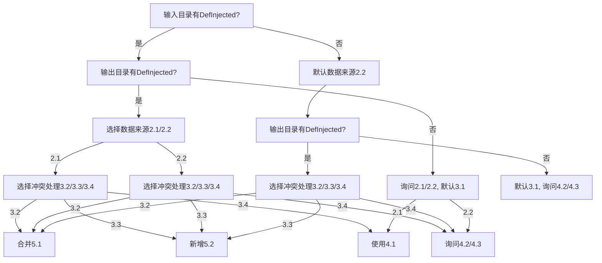
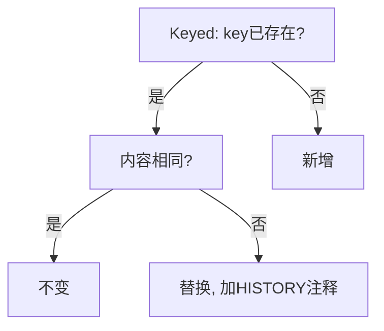

# 智能合并流程设计文档

## 📋 文档概述

本文档定义了 Day Translation 工具中智能合并功能的完整流程设计，包括决策树、数据结构、实现方案和待办事项。智能合并功能负责将新提取的翻译数据与现有翻译文件进行智能合并，保留历史记录和英文注释。

## 🎯 核心概念

### 目录状态判定标准
- **有效目录**: 目录存在且包含至少一个 `.xml` 文件
- **判定方法**: `os.path.isdir(path) && len(list(Path(path).rglob('*.xml'))) > 0`

### 数据格式规范
- **输入数据**: `(key, text, tag, rel_path)` - 四元组格式
- **输出数据**: `(key, text, tag, rel_path, en_text)` - 五元组格式，包含英文注释
- **合并结果**: `(key, text, tag, rel_path, en_text, history)` - 六元组格式，包含历史记录

## 🔧 决策参数定义

### 1. 目录状态检测
- **1.1 输入目录状态**: 检测输入模组是否包含 DefInjected/Keyed 目录
- **1.2 输出目录状态**: 检测输出目录是否已存在翻译文件

### 2. 数据来源选择 (data_source_choice)
- **2.1 definjected_only**: 仅使用英文 DefInjected 目录作为数据源
- **2.2 defs_only**: 扫描 Defs 文件夹提取可翻译内容

### 3. 冲突处理策略 (conflict_resolution)
- **3.1 new**: 新建 - 创建全新的翻译目录结构
- **3.2 merge**: 合并 - 智能合并现有翻译文件
- **3.3 incremental**: 新增 - 扫描对比现有内容，只新增缺少的key
- **3.4 rebuild**: 重建 - 清空输出目录后重新生成

### 4. 模板结构选择 (template_structure)
- **4.1 original_structure**: 保持原英文 DefInjected 结构
- **4.2 defs_by_type**: 按定义类型分组 (如 ThingDefs.xml、PawnKindDefs.xml)
- **4.3 defs_by_file_structure**: 按原始 Defs 文件结构组织

## 🔄 智能合并核心逻辑

### 5.1 合并算法规则
智能合并基于 key 匹配和内容比对，遵循以下优先级规则：

1. **内容无变化**: `input_key == output_key && input_text == output_en_text`
   - **处理**: 保持原状，不做修改
   
2. **内容有更新**: `input_key == output_key && input_text != output_en_text`
   - **处理**: 使用新内容替换原翻译，保留历史注释，更新 EN 注释
   
3. **新增内容**: `input_key` 在输出中不存在
   - **处理**: 新增翻译条目，添加 EN 注释

### 5.2 新增逻辑规则
新增模式基于 key 存在性检查，遵循以下规则：

1. **步骤1：提取输入数据**
   - 从源目录提取所有新的翻译数据
   - 分别处理 Keyed 和 DefInjected 数据
   - 数据格式：`(key, text, tag, file, en_text)`

2. **步骤2：提取输出数据**
   - 从目标目录提取现有翻译数据
   - 同样分别处理 Keyed 和 DefInjected 数据
   - 数据格式：`(key, text, tag, file, en_text)`

3. **步骤3：新增翻译数据**
   - **key 不存在**: `input_key` 在输出数据中不存在
     - **处理**: 添加新翻译，包含历史记录
     - **格式**: `(key, text, tag, file, en_text, "翻译内容: 'text',新增于{date}")`
   - **key 已存在**: `input_key` 在输出数据中已存在
     - **处理**: 跳过，不进行任何操作

### 5.3 注释格式规范

#### 合并模式历史记录格式
```python
# 内容有更新时的历史记录
"原中文: '{old_text}', 原英文: '{old_en_text}' -> 新英文: '{new_text}',更新于{date}"

# 新增内容时的历史记录  
"翻译内容: '{text}',新增于{date}"
```

#### XML注释格式（待实现）
```xml
<!-- 完整示例 -->
<!--HISTORY: 原翻译内容：旧的中文翻译，替换于2024-06-07-->
<!--EN: Updated English Text-->
<key>更新后的中文翻译</key>
```

**注释规则**:
- **历史记录**: 存储在六元组的history字段中
- **EN 注释**: 必须存在，内容与最新英文原文同步
- **历史注释**: 替换时添加，记录原翻译内容和替换时间
- **注释顺序**: 历史注释在前，EN 注释在后

## 📊 智能合并数据结构与实现

### 1. 数据提取与结构

#### 输入目录数据提取
- **方法**: 通过 `_extract_all_translations` 获取
- **返回格式**: `(key, text, tag, file)`
- **说明**: 从输入模组目录提取的原文翻译数据

#### 输出目录数据提取
- **方法**: 通过 `_extract_all_translations` 获取
- **返回格式**: `(key, text, tag, file, en_text)`
- **说明**: 从现有翻译目录提取，包含 EN 注释内容

### 2. 合并逻辑实现

基于 5.1 规则，结合实际需求的合并逻辑：

- **遍历输入目录的所有 key**：
  - **如果 key 在输出目录也存在**：
    - 如果 `text`（输入）和 `en_text`（输出的EN注释）相同：
      → 删除这条数据（无需变更，保持原状）
    - 如果 `text`（输入）和 `en_text` 不同：
      → 用输入的 `text` 替换输出的 `text`，并将原本的 `text` 作为历史注释插入
  - **如果 key 在输出目录不存在**：
    → 新增，带 EN 注释

### 3. 合并后数据结构

- **新增**: `(key, text, tag, rel_path, en_text, "翻译内容: 'text',新增于{date}")`
- **替换**: `(key, text, tag, rel_path, en_text, "原中文: 'old_text', 原英文: 'old_en_text' -> 新英文: 'new_text',更新于{date}")`
- **无变化**: 不包含在合并结果中（include_unchanged=False时）

### 4. 实现建议

#### 扩展 extract_definjected_translations
- 支持提取 EN 注释（如 `<!--EN: ...-->`），并作为 `en_text` 字段返回
- 建议用 lxml 解析注释节点，关联到下一个 key

#### 合并算法优化
- 用 dict 结构加速 key 匹配
- 合并时按上述规则处理，生成最终 list

#### XML 写回处理
- 按 file 分组，批量写回
- 替换时插入历史注释，新增时插入 EN 注释

### 5. 注意事项

- **EN注释的提取与关联**: 需增强 XML 解析逻辑，确保能把注释和 key 关联起来
- **历史注释格式**: 统一用 `<!--HISTORY: 原翻译内容：xxx，替换于YYYY-MM-DD-->`
- **性能优化**: 大文件建议用 lxml，且用 dict 加速 key 匹配
- **Keyed 目录扩展**: 如需同样处理，建议同步扩展

## 🚀 智能合并主流程

### 流程步骤

1. **参数获取**
   - 输入模组目录（input_mod_dir）
   - 输出目录（output_dir）
   - 数据源选择（data_source_choice）
   - 模板结构（template_structure）

2. **提取输入目录翻译**
   - 通过 `_extract_all_translations` 方法
   - 传入输入目录路径和相关参数
   - 获取输入目录下所有可用的翻译数据

3. **提取输出目录翻译**
   - 通过 `_extract_all_translations` 方法
   - 传入输出目录路径和相关参数
   - 获取输出目录下所有现有的翻译数据

4. **翻译对比与合并**
   - 对比输入目录（源语言）和输出目录（目标语言）的翻译内容
   - 按照 5.1 合并逻辑（key、EN注释、历史注释等）进行合并处理
   - 生成最终的合并结果

5. **后续处理**
   - 生成合并后的模板文件
   - 输出合并统计信息

### 6.1 合并提取逻辑详解

- **合并原则**: 以输出目录为主，输入目录（新提取的数据）为增量/更新
- **处理流程**: 遍历输出目录 DefInjected 的 key，和输入目录新提取的 key 进行比对，按 5.1 逻辑处理
- **新增处理**: 新增的 key 也要插入到输出目录的 XML 文件中，并带上 EN 注释

#### 数据来源处理策略

- **选择 2.1 (definjected_only)**：
  - 使用 2.1 作为数据来源
  - 提取输出目录 DefInjected 的 key 和 text
  - 使用 5.1 合并逻辑

- **选择 2.2 (defs_only)**：
  - 使用 2.2 作为数据来源
  - 提取输出目录 DefInjected 的 key 和 text
  - 使用 5.1 合并逻辑

## 🔀 决策流程与情况分析

### 决策流程树

#### 情况一：输入有 DefInjected，输出有 DefInjected
- **询问**: 数据来源选择 2.1/2.2
  - **选择 2.1 (definjected_only)**:
    - **询问**: 冲突处理策略 3.2/3.3/3.4
      - **选择 3.2 (merge)**: 使用智能合并逻辑 5.1
      - **选择 3.3 (incremental)**: 使用新增逻辑 5.2
      - **选择 3.4 (rebuild)**: 使用模板结构 4.1
  - **选择 2.2 (defs_only)**:
    - **询问**: 冲突处理策略 3.2/3.3/3.4
      - **选择 3.2 (merge)**: 使用智能合并逻辑 5.1
      - **选择 3.3 (incremental)**: 使用新增逻辑 5.2
      - **选择 3.4 (rebuild)**: 询问模板结构 4.2/4.3

#### 情况二：输入有 DefInjected，输出无 DefInjected
- **询问**: 数据来源选择 2.1/2.2，默认冲突处理策略 3.1 (new)
  - **选择 2.1 (definjected_only)**: 使用模板结构 4.1
  - **选择 2.2 (defs_only)**: 询问模板结构 4.2/4.3

#### 情况三：输入无 DefInjected，输出有 DefInjected
- **默认**: 数据来源选择 2.2 (defs_only)
- **询问**: 冲突处理策略 3.2/3.3/3.4
  - **选择 3.2 (merge)**: 使用智能合并逻辑 5.1（从 2.2 提取数据，检查输出目录 DefInjected 的 key 和 text）
  - **选择 3.3 (incremental)**: 使用新增逻辑 5.2（从 2.2 提取数据，只新增缺少的key）
  - **选择 3.4 (rebuild)**: 询问模板结构 4.2/4.3

#### 情况四：输入无 DefInjected，输出无 DefInjected
- **默认**: 数据来源选择 2.2 (defs_only)，冲突处理策略 3.1 (new)
- **询问**: 模板结构 4.2/4.3
输入目录有keyed目录
默认提取keyed,默认进行提取。
如果没有keyed，不进行keyed的提取。
输出目录无keyed，看冲突处理策略，是合并、新增还是重建。
### 流程图



## 📝 智能合并示例

### 场景示例

#### 输出目录现有翻译（DefInjected）
```xml
<!--EN: Chatty Nymph-->
<rjw_chatty.title>健谈的仙女</rjw_chatty.title>
```
- **key**: `rjw_chatty.title`
- **text**: `健谈的仙女`
- **EN**: `Chatty Nymph`

#### 输入目录新提取数据（DefInjected 或 Defs）
- **key**: `rjw_chatty.title`
- **text**: `Chatty Nymph`

#### 合并逻辑处理 (5.1)

1. **内容无变化**: `key` 相同，`text` 和 `EN` 相同
   - **处理**: 删除这个参数（无需变更）

2. **内容有更新**: `key` 相同，`text` 和 `EN` 不同
   - **处理**: `text` 替换 `EN`，并保留历史注释，同步 EN 注释

3. **新增内容**: `key` 不存在
   - **处理**: 新增，带 EN 注释

> **说明**: 本流程仅适用于 DefInjected 目录的合并与模板生成，Keyed 目录相关流程参见下文。

## 🔑 Keyed 合并流程设计

### 1. 合并主从关系
- **主导**: 以输出目录 Keyed 为主
- **增量**: 输入目录（新提取的数据）为增量/更新
- **比对**: 遍历输出目录 Keyed 的 key，和输入目录新提取的 key 进行比对，按下述逻辑处理

### 2. Keyed 合并逻辑
- **内容无变化**: `input_key == output_key && output_text == input_EN`
  - **处理**: 不更改
- **内容有更新**: `input_key == output_key && output_text != input_EN`
  - **处理**: `output_text` 替换 `input_text`，**保留历史注释**
- **新增内容**: `input_key` 不存在
  - **处理**: 新增

### 3. 注释与历史规范

#### 历史注释格式
```xml
<!--HISTORY: 原翻译内容：旧内容，替换于2024-06-07-->
<SomeKey>新内容</SomeKey>
```

#### 英文注释格式（可选）
```xml
<!--EN: 英文原文-->
<SomeKey>中文翻译</SomeKey>
```

#### 注释规则
- 历史注释可放在 key 节点前
- 如有英文原文需求，可加 EN 注释，保持与 DefInjected 一致
- 注释顺序：历史注释在前，EN 注释在后

### 4. Keyed 合并流程图



### 5. 实现建议

- **自动化合并**: 建议与 DefInjected 合并流程保持一致的主从判定、注释、历史规范
- **数据结构**: 使用与 DefInjected 相同的六元组格式 `(key, text, tag, rel_path, en_text, history)`
- **性能优化**: 使用 dict 结构加速 key 匹配
- **错误处理**: 增加对 Keyed 文件特有结构的异常处理

## 💻 智能合并核心实现

### 新增模式实现

新增模式使用与合并模式相同的底层逻辑，但只保留新增的部分：

```python
def incremental_mode(input_data, output_data):
    """
    新增模式：只保留输入中存在但输出中不存在的key
    输入：五元组列表 (key, text, tag, rel_path, en_text)
    输出：六元组列表 (key, text, tag, rel_path, en_text, history)
    """
    output_keys = {item[0] for item in output_data}
    new_translations = []
    
    for item in input_data:
        key = item[0]
        if key not in output_keys:
            # 只添加新增的翻译
            new_item = item + (f"翻译内容: '{item[1]}',新增于{today}",)
            new_translations.append(new_item)
    
    return new_translations
```

### 伪代码框架

```python
def perform_smart_merge(output_dir, new_translations, smart_merger):
    """
    智能合并主流程
    遍历输出目录下所有 DefInjected/Keyed 文件，提取现有翻译，
    与 new_translations 按 key 比对，按 5.1 逻辑合并，
    批量调用 smart_merger.merge_multiple_files。
    返回合并结果统计。
    """
    # 1. 遍历输出目录 DefInjected/Keyed 下所有 xml 文件
    xml_files = find_all_xml_files(output_dir)
    
    # 2. 对每个文件，调用 extract_file_translations 提取属于该文件的翻译
    file_mappings = {}
    for xml_file in xml_files:
        existing_translations = extract_file_translations(xml_file, existing_data)
        new_file_translations = extract_file_translations(xml_file, new_translations)
        merged_translations = merge_translations(existing_translations, new_file_translations)
        file_mappings[xml_file] = merged_translations
    
    # 3. 组装 file_mappings，批量合并
    merge_results = smart_merger.merge_multiple_files(file_mappings)
    
    # 4. 返回合并统计结果
    return generate_merge_statistics(merge_results)

def extract_file_translations(xml_file, translations):
    """
    文件级翻译提取
    根据 xml_file 的文件名/路径，从 translations 中筛选出
    属于该文件的 key-text 对，返回 {key: text}
    """
    # 1. 获取 xml_file 的文件名/相对路径
    file_identifier = get_file_identifier(xml_file)
    
    # 2. 遍历 translations，筛选 file_info 匹配的 key-text
    file_translations = {}
    for translation in translations:
        if translation.file_info == file_identifier:
            file_translations[translation.key] = translation
    
    # 3. 返回字典
    return file_translations

def merge_translations(input_data, output_data):
    """
    按照 5.1 合并逻辑处理翻译数据
    输入：五元组列表 (key, text, tag, rel_path, en_text)
    输出：六元组列表 (key, text, tag, rel_path, en_text, history)
    """
    input_map = {item[0]: item for item in input_data}
    output_map = {item[0]: item for item in output_data}
    merged = []
    
    # 处理输入数据中的每个key
    for key, in_item in input_map.items():
        out_item = output_map.get(key)
        
        if out_item:
            # key存在，比较内容
            if in_item[1] == out_item[4]:  # input_text == output_en_text
                # 内容无变化，跳过（include_unchanged=False时）
                continue
            else:
                # 内容有更新，替换并保留历史
                merged.append((
                    key,
                    in_item[1],  # 新翻译
                    out_item[2],  # 保持输出tag
                    out_item[3],  # 保持输出rel_path
                    out_item[4],  # 保持输出en_text
                    f"原中文: '{out_item[1]}', 原英文: '{out_item[4]}' -> 新英文: '{in_item[1]}',更新于{today}"
                ))
        else:
            # key不存在，新增
            merged.append((
                key,
                in_item[1],  # 新翻译
                in_item[2],  # 新tag
                in_item[3],  # 新rel_path
                in_item[4],  # 英文原文
                f"翻译内容: '{in_item[1]}',新增于{today}"
            ))
    
    return merged
```

---